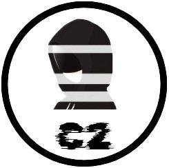

<p align="center">
  
</p>

[](https://www.python.org)
[](https://opensource.org/licenses/MIT)
[](https://github.com/purexploit)
[](https://github.com/purexploit)
[](https://github.com/kaitolegion)

## C2 (beta) version
### Command and Control
C2 - Command and Control a lightweight tool designed to remote control over target server with persistent communication between the infected target and the attacker’s control server over HTTP/S.

## Screenshots


## Requirements
• python 3.x
• requests

## Installation

```sh
python3 -m pip install requests
```

## Usage

Client:<br>
Upload client.php/short-client.php to any infected server

Server:
```sh
python3 c2.py
```

## Credits
<ul>
    <li><a>ChatGPT</a></li>
</ul>

## Follow
<ul>
    <li><a>Github</a></li>
    <li><a>Youtube</a></li>
    <li><a>Facebook</a></li>
</ul>